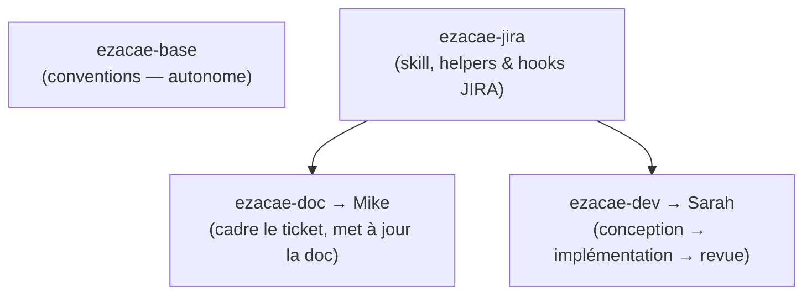

# ezacae-tooling

> Marketplace de plugins Claude Code · usage interne — `v0.1.0`

**Outillage ezacae en 5 lignes.**

Le marketplace qui packe les commandes, skills et agents ezacae — **Mike**, **Sarah**, **chuck**, **morgan**, le pipeline JIRA — en quatre plugins versionnés. Fini le copier-coller dans chaque `~/.claude`.

```text
/plugin marketplace add git@gitlab.com:ezacae/ezacae-claude-tooling.git
```

## 01 · Installation — les quatre plugins

```text
/plugin marketplace add git@gitlab.com:ezacae/ezacae-claude-tooling.git
/plugin install ezacae-base@ezacae-tooling
/plugin install ezacae-jira@ezacae-tooling
/plugin install ezacae-doc@ezacae-tooling
/plugin install ezacae-dev@ezacae-tooling
```

## 02 · Catalogue — ce que chaque plugin apporte

| Plugin | Contenu | Apporte |
|--------|---------|---------|
| **ezacae-base** | hook SessionStart · `conventions.md` | Conventions globales ezacae (contexte, stack documentaire, règles éditoriales) injectées en contexte à chaque session. Source unique d'équipe. |
| **ezacae-jira** | skill · helpers REST · 2 hooks | Infra du pipeline JIRA Mike ⇄ Sarah : skill `jira-pipeline`, helpers REST, hooks de pré-checks et garde de statut. |
| **ezacae-doc** | 6 commandes · 2 agents · → jira | Orchestrateur **Mike** (PO/CTO) et commandes vision · personas · processus, avec les agents `doc-writer` & `stack-writer`. |
| **ezacae-dev** | 2 commandes · 5 skills · 4 agents · → jira | Orchestrateur **Sarah** + skills chuck · john · morgan · grill-me · handoff, et agents auto-suffisants morgan/john. |

## 03 · Dépendances — comment ça s'emboîte



- **ezacae-base** — Conventions, autonome, n'a besoin de rien.
- **ezacae-jira** — Skill, helpers & hooks JIRA. Requis par Mike et Sarah en mode pipeline.
- **ezacae-doc → Mike** — Cadre le ticket, met à jour la doc, passe la main à Sarah.
- **ezacae-dev → Sarah** — Conception → implémentation → revue, puis rend la main à Mike.

!!! info "Pipeline complet"
    Le pipeline `/mike <KEY>` → `/sarah <KEY>` → `/mike <KEY>` suppose les trois plugins outils + leur socle **ezacae-jira**. Hors pipeline, chaque plugin fonctionne seul.

## 04 · Avant de lancer — pré-requis

- **⌘ Claude Code** — CLI, app desktop ou extension IDE — n'importe quel client qui charge les plugins de marketplace.
- **🔑 jira.env par projet** — Mode pipeline : copier `jira.env.example` (livré par ezacae-jira) en `.claude/jira.env` dans le dépôt, et le garder **gitignoré**.
- **🧰 jq** — Requis par les helpers JIRA et la garde de statut. `brew install jq`.
- **📂 contexte projet** — Les commandes Mike lisent `.claude/CLAUDE.md` et `.claude/doc-manifest.md` du dépôt — état propre à chaque projet.

---

ezacae · marketplace interne Claude Code · [git@gitlab.com:ezacae/ezacae-claude-tooling.git](https://gitlab.com/ezacae/ezacae-claude-tooling)
