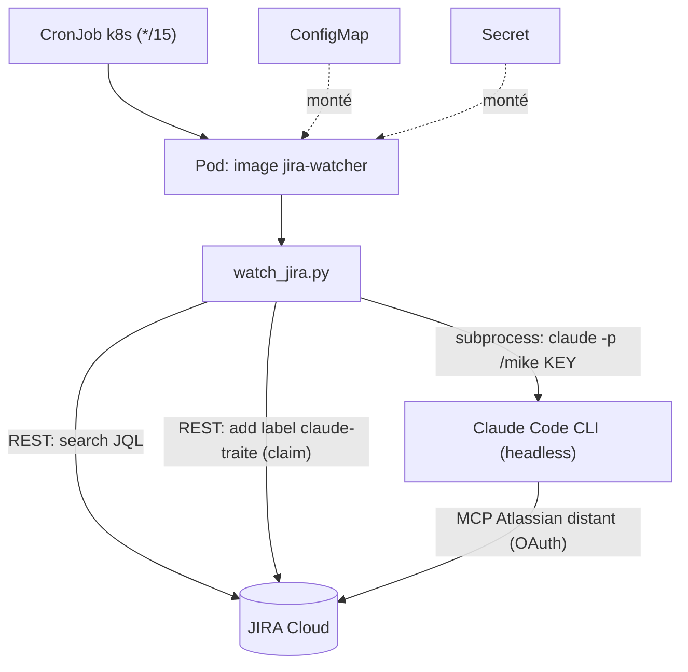
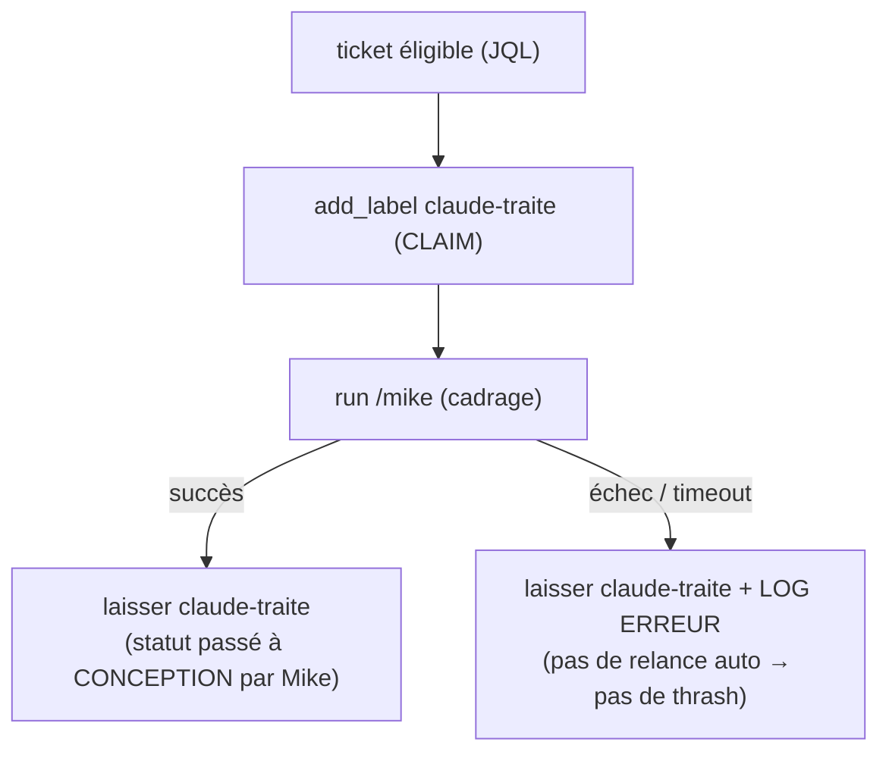

# Watcher JIRA → cadrage Mike automatique

> **Statut** : Brouillon (conception)
> **Type** : feature
> **Auteur** : chuck (pipeline Sarah)
> **Cible d'exécution** : `/morgan docs/jira-watcher-mike.md`

## 1. Objectif

Détecter automatiquement, toutes les 15 minutes, les **nouveaux tickets JIRA à traiter**
sur une liste de projets prédéfinie, et lancer pour chacun la commande Claude Code
`/mike <clé>` selon son **comportement nominal** (cadrage → `CONCEPTION` → enchaînement
sur `/sarah`).

Un ticket est éligible s'il remplit **toutes** ces conditions :

- il appartient à un projet listé dans la **ConfigMap** ;
- il porte l'étiquette **`claude`** ;
- son statut est **`NOUVEAU`** ;
- il ne porte **pas** déjà l'étiquette de claim **`claude-traite`**.

Le composant est packagé en image conteneur, déployé via **ArgoCD**, et déclenché par un
**CronJob Kubernetes** (`*/15 * * * *`).

## 2. Contexte & contraintes (issues de l'exploration)

| Sujet | Décision | Raison |
|---|---|---|
| Langage du watcher | **Python 3** | Choix utilisateur ; logique multi-projets + erreurs plus robuste. |
| Exécution de `/mike` | **CLI `claude` headless** (`claude -p`) dans l'image | `/mike` est une slash command Claude Code ; on réutilise la commande telle quelle. |
| Auth Claude (CLI) | **Token OAuth abonnement** pré-injecté par Secret | Choix utilisateur. ⚠️ expire → renouvellement à prévoir (cf. §8). |
| Accès JIRA pour `/mike` | **MCP Atlassian distant `claude.ai`** + credentials OAuth **pré-injectés** | Choix utilisateur. Image plus légère (pas de binaire MCP). ⚠️ même contrainte d'expiration. |
| Accès JIRA pour le watcher | **REST v3 + token API** (`JIRA_EMAIL:JIRA_API_TOKEN`) | Cohérent avec `jira-download.sh` / `jira-attach.sh` du repo. Indépendant du MCP. |
| Déduplication | **Étiquette de claim `claude-traite`** posée *avant* lancement | Choix utilisateur. Découplé de `/mike` ; protège contre les recouvrements de runs. |
| Périmètre de `/mike` | **Comportement nominal** : cadrage → `CONCEPTION` → `/sarah` (cycle complet autonome) | Choix utilisateur. Aucun garde-fou de périmètre ; `mike.md` non modifié. ⚠️ runs potentiellement longs (cf. §8). |
| Emplacement | **`deploy/jira-watcher/`** dans ce repo | Choix utilisateur. ArgoCD pointe sur `deploy/jira-watcher/k8s`. |

**Point ouvert assumé** : aucune `skills/john/stacks/<stack>.md` n'existe pour un profil
« infra Python + Kubernetes ». On s'aligne sur les conventions du repo (style des scripts
Bash existants, commentaires en français, `set -euo pipefail` côté shell). À créer
ultérieurement si l'équipe industrialise ce type de livrable.

## 3. Modèle de données (configuration)

### 3.1 ConfigMap — `jira-watcher-config` (montée en fichier `/etc/jira-watcher/config.yaml`)

```yaml
jira_base_url: "https://ezacae.atlassian.net"
projects: ["CRM", "ACME"]          # clés de projet JIRA surveillées
trigger_label: "claude"            # étiquette d'éligibilité
claim_label: "claude-traite"       # étiquette de claim (déduplication)
watched_statuses: ["NOUVEAU"]      # statuts déclencheurs
slash_command: "/mike {key}"       # commande lancée (templating sur {key})
claude_timeout_seconds: 3600       # timeout par run /mike (cycle complet → 60 min)
max_issues_per_run: 10             # garde-fou: nb max de tickets traités par cycle
```

### 3.2 Type Python (dataclass, validé au chargement)

```python
@dataclass(frozen=True)
class WatcherConfig:
    jira_base_url: str
    projects: list[str]
    trigger_label: str
    claim_label: str
    watched_statuses: list[str]
    slash_command: str
    claude_timeout_seconds: int
    max_issues_per_run: int
```

Règles de validation (lèvent `ConfigError`) : `projects` non vide ; `watched_statuses`
non vide ; `slash_command` contient `{key}` ; `claude_timeout_seconds` > 0 ;
`max_issues_per_run` > 0 ; `jira_base_url` commence par `http`.

### 3.3 Secret — `jira-watcher-secrets`

| Clé | Usage | Monté en |
|---|---|---|
| `jira-email` | REST watcher (auth basic) | env `JIRA_EMAIL` |
| `jira-api-token` | REST watcher (auth basic) | env `JIRA_API_TOKEN` |
| `claude-credentials.json` | OAuth CLI Claude **+** OAuth MCP Atlassian distant | fichier `~/.claude/.credentials.json` (mode 600) |

> `claude-credentials.json` est **capturé sur un poste authentifié** (`~/.claude/.credentials.json`
> après `claude` + connexion + autorisation du MCP `claude.ai Atlassian`) puis stocké en Secret.
> Procédure de (re)génération détaillée en §8.

## 4. Architecture

### 4.1 Vue d'ensemble



### 4.2 Fichiers à créer

| Couche | Fichier |
|---|---|
| Watcher (logique) | `deploy/jira-watcher/jira_watcher/config.py` |
| | `deploy/jira-watcher/jira_watcher/jql.py` |
| | `deploy/jira-watcher/jira_watcher/jira_client.py` |
| | `deploy/jira-watcher/jira_watcher/mike_runner.py` |
| | `deploy/jira-watcher/jira_watcher/orchestrator.py` |
| | `deploy/jira-watcher/jira_watcher/__main__.py` |
| Tests | `deploy/jira-watcher/tests/test_config.py` |
| | `deploy/jira-watcher/tests/test_jql.py` |
| | `deploy/jira-watcher/tests/test_jira_client.py` |
| | `deploy/jira-watcher/tests/test_mike_runner.py` |
| | `deploy/jira-watcher/tests/test_orchestrator.py` |
| Packaging | `deploy/jira-watcher/Dockerfile` |
| | `deploy/jira-watcher/pyproject.toml` |
| | `deploy/jira-watcher/.dockerignore` |
| | `deploy/jira-watcher/image/claude-config.json` (config marketplace + plugins activés) |
| k8s / ArgoCD | `deploy/jira-watcher/k8s/configmap.yaml` |
| | `deploy/jira-watcher/k8s/secret.example.yaml` (gabarit, **non rempli**) |
| | `deploy/jira-watcher/k8s/cronjob.yaml` |
| | `deploy/jira-watcher/k8s/application.yaml` (ArgoCD `Application`) |
| | `deploy/jira-watcher/k8s/kustomization.yaml` |
| Doc | `deploy/jira-watcher/README.md` |

### 4.3 Découpage en unités testables (sans effet de bord cachés)

- **`jql.build_jql(config) -> str`** — pur. Construit
  `project IN (CRM,ACME) AND labels = "claude" AND status IN ("NOUVEAU") AND labels NOT IN ("claude-traite") ORDER BY created ASC`.
- **`config.load_config(mapping) -> WatcherConfig`** — pur + validation.
- **`jira_client.JiraClient`** — encapsule REST. HTTP injecté (`requests.Session` ou
  callable) pour testabilité. Méthodes : `search_keys(jql, max_results) -> list[str]`,
  `add_label(key, label) -> None`, `remove_label(key, label) -> None`.
- **`mike_runner.build_invocation(key, config) -> (argv, prompt, env)`** — pur. Construit
  la ligne `claude` + le prompt (`/mike {key}`) + l'env.
- **`mike_runner.run(key, config, runner=subprocess_runner) -> MikeResult`** — exécute via
  un `runner` injecté (la vraie impl. appelle `subprocess.run` avec `timeout`). Mappe
  succès / échec / timeout vers `MikeResult(status, exit_code, log_tail)`.
- **`orchestrator.process(client, config, runner) -> RunReport`** — séquence : `build_jql`
  → `search_keys` → pour chaque clé (claim → run → comptabilisation). Tout est injecté,
  donc testable sans réseau ni subprocess.
- **`__main__`** — fin : lit `config.yaml`, instancie les vrais clients, appelle `process`,
  logge le `RunReport`, code de sortie ≠ 0 si au moins un échec **d'infrastructure**
  (auth, réseau) — un cadrage `/mike` qui échoue n'arrête pas le batch.

### 4.4 Invocation `claude` headless

```bash
claude -p "<prompt>" \
  --dangerously-skip-permissions \
  --output-format json
```

- `--dangerously-skip-permissions` : conteneur isolé, aucun humain pour approuver.
  Justifié et borné par l'allowlist de projets + le timeout + l'étiquette `claude` par ticket.
- Timeout dur côté Python (`claude_timeout_seconds`) : tue le process et marque `TIMEOUT`.
- `HOME=/home/claude` ; `~/.claude/.credentials.json` (Secret) ; marketplace + plugins
  activés via `~/.claude/claude-config.json` baké dans l'image.

## 5. Déduplication & gestion d'échec (cas limites)



- **Claim avant lancement** : empêche un run suivant (ou concurrent) de re-traiter le même
  ticket. `concurrencyPolicy: Forbid` côté CronJob renforce l'anti-recouvrement.
- **Échec/timeout `/mike`** : on **conserve** le claim et on logge une **erreur explicite**
  (`KEY` + extrait de log). Pas de relance automatique → évite de marteler un ticket qui
  échoue en boucle. Reprise = retrait manuel de `claude-traite` (documenté dans le README).
  *Alternative écartée* : rollback du label en cas d'échec (risque de thrash + coût).
- **Crash entre claim et run** (rare) : ticket claimé non traité → reprise manuelle. Toléré.
- **Plusieurs tickets/cycle** : traités **séquentiellement** (pas de `claude` en parallèle —
  limites de débit + charge), plafonnés par `max_issues_per_run`. Dépassement → log d'avertissement.

## 6. Sécurité

- Secrets (token OAuth Claude, OAuth MCP, token JIRA) **uniquement** en Secret k8s, jamais
  dans l'image ni dans Git. `secret.example.yaml` ne contient que des placeholders.
- `claude-credentials.json` monté en lecture seule, `defaultMode: 0600`.
- `--dangerously-skip-permissions` borné par : allowlist projets (ConfigMap), étiquette
  `claude` par ticket, timeout, conteneur non-root sans privilèges (`securityContext`).
- RBAC : le ServiceAccount du CronJob n'a **aucun** droit cluster particulier (il ne parle
  qu'à JIRA et à l'API Anthropic via réseau).

## 7. Performance / exploitation

- 1 cycle / 15 min. Coût piloté par le nombre de tickets `NOUVEAU+claude` × cadrage.
- `activeDeadlineSeconds` (CronJob) = `max_issues_per_run × claude_timeout_seconds` + marge.
- `resources.requests/limits` modestes (le gros du travail est distant : LLM + JIRA).
- Logs structurés (un objet `RunReport` JSON en fin de run : vus, traités, succès, échecs).

## 8. Risques & maintenance

| Risque | Impact | Mitigation |
|---|---|---|
| **Expiration token OAuth Claude / MCP** | le cron échoue silencieusement | Détecter l'erreur d'auth → code sortie ≠ 0 + log explicite (déclenche alerte) ; **procédure de renouvellement** documentée ; envisager un check de validité en début de run. |
| Cycle complet autonome (`/mike`→`/sarah`→`morgan`→MR) déclenché sans relecture humaine | sur-automatisation / MR non souhaitées | Allowlist stricte de projets (ConfigMap) + étiquette `claude` explicite par ticket + plafond `max_issues_per_run` + surveillance des logs. C'est le comportement **voulu** : maîtrisé par qui pose l'étiquette `claude`. |
| Run long (cycle complet) > 15 min | recouvrement de cron | `concurrencyPolicy: Forbid` + `activeDeadlineSeconds` calé sur `claude_timeout_seconds` (60 min). |
| Ticket claimé puis `/mike` échoue | ticket non cadré | Log erreur ciblé ; reprise manuelle (retrait label). |
| Dérive des noms de statut (casse) | JQL ne matche pas | Statuts dans la ConfigMap (modifiables sans rebuild) ; JQL insensible documenté. |

**Procédure de renouvellement des credentials (§ référencée par le README)** :
1. Sur un poste authentifié : `claude` (connexion abonnement) puis vérifier que le MCP
   `claude.ai Atlassian` est autorisé (un appel JIRA réussi).
2. Copier `~/.claude/.credentials.json`.
3. `kubectl create secret generic jira-watcher-secrets --from-file=claude-credentials.json=... --from-literal=jira-email=... --from-literal=jira-api-token=... --dry-run=client -o yaml | kubectl apply -f -`.

---

## Plan d'implémentation

> **Pour l'exécution :** `/morgan docs/jira-watcher-mike.md` (autonome, TDD).

**Objectif :** un watcher Python testé + son packaging conteneur + ses manifestes
ArgoCD/Kubernetes, lançant `/mike <clé>` (comportement nominal) sur les tickets `NOUVEAU+claude`.
**Architecture :** logique pure et injectable (config/JQL/clients/runner/orchestrateur),
empaquetée en image headless Claude Code, déclenchée par CronJob, déployée par ArgoCD.

**Outils de vérification :** `pytest` (tests), `python -m jira_watcher --dry-run` (smoke),
`kubectl apply --dry-run=client -k deploy/jira-watcher/k8s` (manifestes),
`docker build deploy/jira-watcher` (image). Préfixe de branche/MR : aucun (hors pipeline JIRA).

---

### Phase 1 — Squelette projet & configuration

#### Tâche 1.1 : `pyproject.toml` + structure de paquet
**Fichiers :** Créer `deploy/jira-watcher/pyproject.toml`, `deploy/jira-watcher/jira_watcher/__init__.py`
- [ ] Déclarer le paquet `jira_watcher`, dépendances (`requests`, `PyYAML`), dev (`pytest`)
- [ ] `pip install -e deploy/jira-watcher[dev]` réussit
- [ ] Commit

#### Tâche 1.2 : `config.load_config` (TDD)
**Fichiers :** Créer `jira_watcher/config.py` | Test `tests/test_config.py`
- [ ] Écrire les tests : mapping valide → `WatcherConfig` ; chaque règle de validation lève `ConfigError` (projets vides, `{key}` manquant, timeout ≤ 0, url non http)
- [ ] Vérifier l'échec (`pytest tests/test_config.py` → rouge)
- [ ] Implémenter dataclass + `load_config`
- [ ] Vérifier le succès (vert)
- [ ] Commit

### Phase 2 — Construction de la requête JIRA

#### Tâche 2.1 : `jql.build_jql` (TDD)
**Fichiers :** Créer `jira_watcher/jql.py` | Test `tests/test_jql.py`
- [ ] Écrire les tests : sortie attendue pour 1 projet / N projets / N statuts ; échappement des valeurs ; clause `labels NOT IN (claim)` ; tri `created ASC`
- [ ] Rouge
- [ ] Implémenter `build_jql(config)`
- [ ] Vert
- [ ] Commit

### Phase 3 — Client JIRA REST

#### Tâche 3.1 : `JiraClient.search_keys` (TDD, HTTP mocké)
**Fichiers :** Créer `jira_watcher/jira_client.py` | Test `tests/test_jira_client.py`
- [ ] Écrire le test : réponse `/rest/api/3/search` mockée → liste de clés ; respect de `max_results` ; auth basic positionnée
- [ ] Rouge
- [ ] Implémenter `JiraClient.__init__(base_url, email, token, http)` + `search_keys`
- [ ] Vert
- [ ] Commit

#### Tâche 3.2 : `add_label` / `remove_label` (TDD, HTTP mocké)
**Fichiers :** Modifier `jira_watcher/jira_client.py` | Modifier `tests/test_jira_client.py`
- [ ] Écrire le test : `add_label` envoie `PUT /issue/{key}` corps `{"update":{"labels":[{"add":"claude-traite"}]}}` ; `remove_label` symétrique ; erreur HTTP → exception
- [ ] Rouge
- [ ] Implémenter les deux méthodes
- [ ] Vert
- [ ] Commit

### Phase 4 — Lanceur `/mike` headless

#### Tâche 4.1 : `build_invocation` (TDD, pur)
**Fichiers :** Créer `jira_watcher/mike_runner.py` | Test `tests/test_mike_runner.py`
- [ ] Écrire le test : argv contient `claude`, `-p`, `--dangerously-skip-permissions` ; prompt = `slash_command` templaté (`/mike CRM-123`)
- [ ] Rouge
- [ ] Implémenter `build_invocation(key, config)`
- [ ] Vert
- [ ] Commit

#### Tâche 4.2 : `run` avec runner injecté (TDD)
**Fichiers :** Modifier `jira_watcher/mike_runner.py` | Modifier `tests/test_mike_runner.py`
- [ ] Écrire le test : runner fake renvoyant exit 0 → `MikeResult(status="OK")` ; exit ≠ 0 → `"FAILED"` ; exception timeout → `"TIMEOUT"` ; `log_tail` rempli
- [ ] Rouge
- [ ] Implémenter `run(key, config, runner)` + `MikeResult`
- [ ] Vert
- [ ] Commit

### Phase 5 — Orchestrateur

#### Tâche 5.1 : `process` happy path (TDD)
**Fichiers :** Créer `jira_watcher/orchestrator.py` | Test `tests/test_orchestrator.py`
- [ ] Écrire le test : client + runner fakes ; 2 clés → claim posé sur chaque (ordre : claim **avant** run) ; `RunReport(seen=2, processed=2, ok=2)`
- [ ] Rouge
- [ ] Implémenter `process(client, config, runner)` + `RunReport`
- [ ] Vert
- [ ] Commit

#### Tâche 5.2 : échec `/mike` & plafond (TDD)
**Fichiers :** Modifier `jira_watcher/orchestrator.py` | Modifier `tests/test_orchestrator.py`
- [ ] Écrire le test : run échoue → label **conservé**, `RunReport.failed=1`, pas d'exception ; nb de clés > `max_issues_per_run` → traite le plafond + log
- [ ] Rouge
- [ ] Implémenter la gestion d'échec + plafond
- [ ] Vert
- [ ] Commit

#### Tâche 5.3 : entrée `__main__` + `--dry-run` (TDD léger)
**Fichiers :** Créer `jira_watcher/__main__.py` | Modifier `tests/test_orchestrator.py`
- [ ] Écrire le test : `--dry-run` liste les clés éligibles sans claim ni run (clients fakes) ; code sortie ≠ 0 si erreur d'auth/réseau
- [ ] Rouge
- [ ] Implémenter `main()` (lecture `config.yaml`, vrais clients, log `RunReport` JSON)
- [ ] Vert
- [ ] Commit

### Phase 6 — Packaging conteneur

#### Tâche 6.1 : config Claude bakée (marketplace + plugins)
**Fichiers :** Créer `deploy/jira-watcher/image/claude-config.json`
- [ ] Déclarer le marketplace `ezacae-claude-tooling` (source = copie locale `/opt/ezacae-tooling`) + plugins activés `ezacae-base`, `ezacae-jira`, `ezacae-doc` + serveur MCP `claude.ai Atlassian`
- [ ] Commit

#### Tâche 6.2 : Dockerfile + .dockerignore
**Fichiers :** Créer `deploy/jira-watcher/Dockerfile`, `deploy/jira-watcher/.dockerignore`
- [ ] Base Node + Python ; `npm i -g @anthropic-ai/claude-code` ; copier les plugins (`/opt/ezacae-tooling`) ; installer le paquet `jira_watcher` ; user non-root `claude` (`HOME=/home/claude`) ; `ENTRYPOINT ["python","-m","jira_watcher"]`
- [ ] `docker build deploy/jira-watcher -t jira-watcher:test` réussit
- [ ] `docker run --rm jira-watcher:test --help` affiche l'aide ; `claude --version` OK dans l'image
- [ ] Commit

### Phase 7 — Manifestes Kubernetes / ArgoCD

#### Tâche 7.1 : ConfigMap + Secret gabarit
**Fichiers :** Créer `k8s/configmap.yaml`, `k8s/secret.example.yaml`
- [ ] ConfigMap = `config.yaml` (§3.1) ; secret.example = placeholders (jamais de vraie valeur)
- [ ] Commit

#### Tâche 7.2 : CronJob
**Fichiers :** Créer `k8s/cronjob.yaml`
- [ ] `schedule: "*/15 * * * *"`, `concurrencyPolicy: Forbid`, `restartPolicy: Never`, `backoffLimit: 0`, `activeDeadlineSeconds`, montages ConfigMap (`/etc/jira-watcher`) + Secret (`~/.claude/.credentials.json` 0600 + env JIRA), `securityContext` non-root
- [ ] Commit

#### Tâche 7.3 : Application ArgoCD + kustomization
**Fichiers :** Créer `k8s/application.yaml`, `k8s/kustomization.yaml`
- [ ] `Application` ArgoCD pointant `repoURL` ce repo, `path: deploy/jira-watcher/k8s`, sync auto
- [ ] `kubectl apply --dry-run=client -k deploy/jira-watcher/k8s` passe (hors `application.yaml` qui nécessite le CRD ArgoCD — vérifier en `--dry-run` séparé ou `kustomize build`)
- [ ] Commit

### Phase 8 — Documentation

#### Tâche 8.1 : README du composant
**Fichiers :** Créer `deploy/jira-watcher/README.md`
- [ ] Documenter : config ConfigMap, capture/renouvellement des credentials (§8), reprise manuelle (retrait `claude-traite`), build & déploiement ArgoCD
- [ ] Commit
