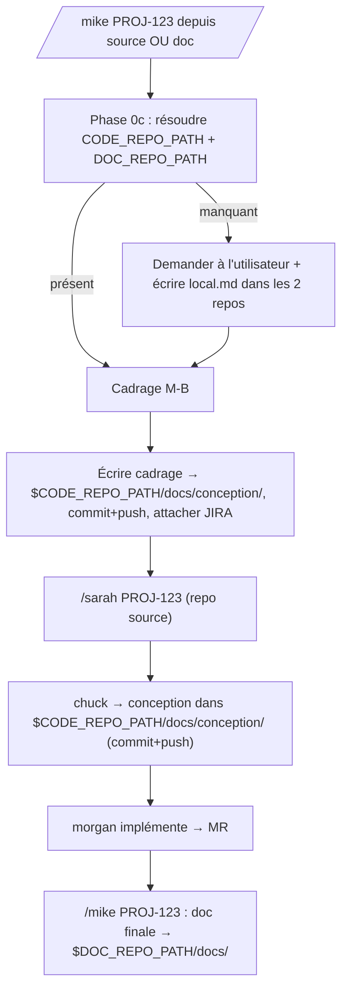

# Conception — Mike multi-repos : résolution des chemins source/doc et routage des livrables

**Statut :** Brouillon
**Date :** 2026-06-22
**Périmètre :** plugins `ezacae-doc` (Mike, Mike-PO, Mike-CTO) et `ezacae-dev` (Sarah, chuck, morgan)

---

## 1. Problème

Mike est aujourd'hui implicitement lié au **repo de documentation** : il lit `.claude/CLAUDE.md`,
`.claude/doc-manifest.md` et `docs/` relativement au répertoire courant, et il pousse la doc +
`mkdocs.yml` dans ce même repo. Le **repo de code source** est un dépôt distinct, dont le chemin
n'est connu que de Mike-CTO via `CODE_REPO_PATH` (`.claude/local.md`).

On veut que Mike :

1. **connaisse les deux dossiers** — sources de l'application et documentation fonctionnelle —
   et qu'ils soient accessibles **qu'il soit lancé depuis l'un ou l'autre** ;
2. **route les livrables** : fiches de **cadrage** et documents de **conception** → repo source ;
   **documentation fonctionnelle et technique** → repo de doc ;
3. **demande l'information manquante au démarrage** et la **persiste dans un fichier**.

## 2. Décisions actées

- **Stockage des chemins** : étendre le pattern existant `.claude/local.md` (gitignored), un par repo,
  contenant les deux chemins absolus.
- **Emplacement cadrage + conception** : `$CODE_REPO_PATH/docs/conception/`.
- **Périmètre** : Mike **et** Sarah (la conception de chuck/Sarah est alignée sur le même dossier).
- **Factorisation** : logique inline, canonique dans `/mike`, référencée brièvement par Mike-PO/Mike-CTO
  (aucun hook n'injecte la racine du plugin `ezacae-doc` → un fichier partagé serait fragile à référencer ;
  le plugin inline déjà, ex. le bloc `mkdocs.yml` dupliqué PO/CTO).

## 3. Composants

### A. Config `.claude/local.md` (format étendu)

Fichier personnel, **gitignored** (`.claude/local.md` est déjà dans `.gitignore`), présent dans **les deux repos** :

```
## Config locale (ne pas commiter)
- **CODE_REPO_PATH :** /chemin/absolu/vers/source
- **DOC_REPO_PATH :**  /chemin/absolu/vers/doc
```

Les deux champs sont des chemins **absolus**. Le fichier est écrit à l'identique dans le repo source
et dans le repo doc, de sorte que Mike résolve les deux chemins quel que soit son point de lancement.

### B. `/mike` — nouvelle `Phase 0b — Résolution des chemins projet`

Insérée **après la Phase 0** (sync Git/JIRA via hook) et **avant la Phase 1**.

1. Lire `.claude/local.md` du répertoire courant ; en extraire `CODE_REPO_PATH` et `DOC_REPO_PATH`.
2. **Auto-détecter la nature du cwd** pour pré-remplir le chemin manquant :
   - repo **doc** si `.claude/doc-manifest.md` existe ou si `docs/00_vision`/`docs/01_product` sont présents ;
   - repo **source** si un manifeste de stack est présent à la racine (`package.json`, `pubspec.yaml`,
     `composer.json`, `pyproject.toml`, `go.mod`, `pom.xml`, …) et qu'il n'y a pas de `doc-manifest.md`.
   - Le chemin auto-détecté vaut `pwd`.
3. Vérifier l'existence des deux dossiers (`ls`).
4. Si un chemin manque ou est invalide :
   - **demander** à l'utilisateur le(s) chemin(s) manquant(s), en pré-remplissant le chemin auto-détecté ;
   - **écrire `.claude/local.md` dans les deux repos** (source + doc) ;
   - garantir la présence de `.claude/local.md` dans le `.gitignore` de chaque repo (l'ajouter sinon).
5. Confirmer en une ligne : `📁 Source : <CODE_REPO_PATH> · Doc : <DOC_REPO_PATH>`.

À partir de là, **toutes les lectures/écritures de documentation de Mike passent par `$DOC_REPO_PATH`** :

- Phase 1 : `$DOC_REPO_PATH/.claude/CLAUDE.md`, `$DOC_REPO_PATH/.claude/doc-manifest.md`.
- Phase 2 : `find $DOC_REPO_PATH/docs/ -name "*.md"`.

Lancé depuis le repo doc, `$DOC_REPO_PATH == pwd` : comportement strictement inchangé.

### C. Routage des livrables

| Document | Destination |
|---|---|
| Vision / personas / processus (Mike-PO) | `$DOC_REPO_PATH/docs/00_vision/`, `$DOC_REPO_PATH/docs/01_product/` |
| Doc technique architecture/auth/bdd/api/déploiement/écrans (Mike-CTO) | `$DOC_REPO_PATH/docs/02_…/04_…` |
| `mkdocs.yml` | racine `$DOC_REPO_PATH` |
| **Fiche de cadrage** (Mike, mode pipeline M-B) | `$CODE_REPO_PATH/docs/conception/cadrage-<sujet>.md` |
| **Conception technique** (chuck/Sarah) | `$CODE_REPO_PATH/docs/conception/<nom>.md` |

Précisions :

- **Fiche de cadrage** : Mike l'**écrit** dans `$CODE_REPO_PATH/docs/conception/cadrage-<sujet>.md`,
  la **commite et la pousse** dans le repo source (`git -C $CODE_REPO_PATH add docs/conception/cadrage-<sujet>.md`,
  `commit -m "docs(cadrage): <sujet>"`, `push`), **puis** l'attache au ticket JIRA (`jira-attach.sh`).
  La version commitée dans le repo source et l'attachement JIRA sont ainsi cohérents.
- **Conception technique** : chuck/Sarah tournent avec le repo source comme cwd, donc
  `$CODE_REPO_PATH/docs/conception/<nom>.md` s'écrit `docs/conception/<nom>.md`. La conception **reste
  commitée et poussée** avant le dispatch de morgan (précondition inchangée).

### D. `mike-po.md` / `mike-cto.md`

- Ajouter une résolution `$DOC_REPO_PATH` (même algorithme que B, repli `pwd` si lancé depuis le repo doc).
- Scoper **toutes** les opérations doc sur le repo doc : `git -C $DOC_REPO_PATH …` (fetch/status/checkout/
  add/commit/push), lectures et écritures via chemins absolus `$DOC_REPO_PATH/…`, génération de
  `mkdocs.yml` à la racine `$DOC_REPO_PATH`.
- **Mike-CTO** : sa `Phase 0b` actuelle (ask/save de `CODE_REPO_PATH`) est absorbée par la résolution
  unifiée — `CODE_REPO_PATH` provient désormais de la même `local.md` à deux champs. La synchro du code
  source (pull, extraction `commit_ref`) reste, mais s'appuie sur le chemin déjà résolu.
- Lancés directement depuis le repo doc (`$DOC_REPO_PATH == pwd`), le comportement reste identique à l'actuel.

### E. `sarah.md` / `chuck/SKILL.md` / `morgan/SKILL.md`

Changement mécanique du chemin de conception `docs/<nom>.md` → `docs/conception/<nom>.md` :

- `chuck/SKILL.md` §9 — document de conception, ligne de passation, bloc `git add`.
- `sarah.md` — table de synchro statut↔phases (3.2 `jira-attach`), Phase 3.2/3.3 (pré-requis commit/push).
- `morgan/SKILL.md` — référence au chemin du document de conception passé en argument.

Sarah n'a pas besoin de `$DOC_REPO_PATH` : elle opère dans le repo source et rend la main à `/mike <KEY>`,
qui résout les chemins lui-même.

## 4. Flux (mode pipeline JIRA)



## 5. Compatibilité

- Lancement depuis le repo doc (habitude actuelle) : inchangé, les `$DOC_REPO_PATH` valent `pwd`.
- Premier lancement sans `local.md` : auto-détection + une question, puis persistance dans les deux repos.
- Le secret JIRA (`jira.env`) et `.claude/local.md` restent hors versionnement (déjà dans `.gitignore`).

## 6. Hors périmètre

- Migration des fiches de cadrage / conceptions existantes vers le nouveau dossier.
- Modification des hooks SessionStart (aucun nouvel injection de chemin nécessaire).
- Les commandes doc unitaires (`/vision-produit`, `/personas-projet`, `/processus-projet`) — elles restent
  invoquées dans le contexte du repo doc ; à scoper ultérieurement si besoin.
