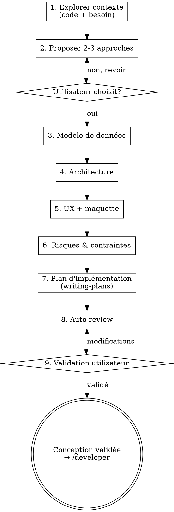

# Conception technique

Produit une specification detaillee et actionnable **avant** toute ecriture de code. Couvre : exploration, approches, modele de donnees, architecture, UX, risques, plan d'implementation TDD.

> **Conventions de stack (plugin ezacae-dev).** Les références à `skills/developer/stacks/<stack>.md` plus bas désignent des fichiers **embarqués dans le plugin ezacae-dev**, pas des fichiers du projet. Leur chemin absolu est injecté au démarrage par le hook SessionStart d'ezacae-dev (ligne « Conventions de stack embarquées : <racine>/skills/developer/stacks/<stack>.md ») — les lire via ce chemin absolu.

<HARD-GATE>
AUCUN code, AUCUN scaffolding, AUCUNE implementation tant que la conception n'est pas ecrite, auto-reviewee et validee par l'utilisateur. Pas d'exception — meme pour les "petites modifs".
</HARD-GATE>

## Quand NE PAS utiliser

- Exécution d'une conception existante → utiliser `/developer <chemin>`
- Bug trivial (typo, CSS, config) ne nécessitant ni conception ni exécuteur — corriger directement

## Méthode : Superpowers, invoquée — jamais recopiée

Chuck **n'écrit pas** la méthodologie générale (exploration, questionnement, structure de plan, debug). Il l'**invoque** (tool Skill) au moment voulu depuis le plugin `superpowers` — couche 1 du harnais, toujours à jour — et ne garde que la **colle ezacae** : quoi produire, dans les termes de la stack, avec la convention de doc et le HARD-GATE. Les skills à invoquer sont indiqués **à chaque étape** ci-dessous (`superpowers:brainstorming`, `:systematic-debugging`, `:writing-plans`, `ui-ux-pro-max:ui-ux-pro-max`).

**Règle :** invoquer **réellement** le skill quand l'étape l'exige — ne jamais paraphraser sa méthode ici. Un skill Superpowers absent est signalé au démarrage par le hook `check-superpowers` ; l'installer alors : `claude plugin install superpowers@claude-plugins-official`.

> **Chuck est le propriétaire de l'exploration.** Si l'orchestrateur `/sarah` a déjà cadré le besoin en amont, ne pas redemander ce qui est tranché — mais l'exploration du code (étape 1) reste de la responsabilité de chuck.

## Sources de vérité

Chuck n'est lié à aucune stack. **Détecter d'abord la stack** (procédure de référence dans le skill `developer`, section « Détection de la stack »), puis charger :

1. Les conventions génériques de la stack détectée : `skills/developer/stacks/<stack>.md`.
2. `CLAUDE.md` (racine projet) — conventions spécifiques au projet : modèle de données, catalogue de composants/hooks maison, intégrations, palette.

En cas de conflit, **`CLAUDE.md` du projet prime**. La conception doit refléter la stack détectée, jamais en présumer une.

## Process



### 1. Explorer le contexte

**Colle ezacae — détecter la stack et explorer le code (silencieux) :**

- **Détecter la stack** (procédure du skill `developer`) et charger `skills/developer/stacks/<stack>.md` + le `CLAUDE.md` du projet.
- Lire les fichiers, modules, composants, types liés à la demande ; vérifier les commits récents sur la zone ; repérer les patterns existants réutilisables.

**Comprendre le besoin — invoquer `superpowers:brainstorming`** (questionnement collaboratif, une exploration à la fois : ne pas la redire ici). Chuck y ajoute :

- Déterminer le type : **nouvelle fonctionnalité** | **modification** | **correction de bug**
- Identifier les personas impactés (cf. `CLAUDE.md` / docs produit du projet)

**Si correction de bug — invoquer `superpowers:systematic-debugging`** (reproduction + isolation de la cause racine avant tout fix). La conception ezacae décrit alors **la cause racine**, **le correctif** et **le test de régression** qui échoue aujourd'hui — pas une architecture greenfield.

### 2. Proposer des approches

**Invoquer à nouveau `superpowers:brainstorming`** pour cette phase (2-3 approches, trade-offs, recommandation argumentée, attente de validation — ne pas recopier sa méthode). Spécificité ezacae : approches **exprimées dans les termes de la stack détectée**.

```
(exemple — stack Next.js)
Approche A — Server Action directe
+ Simple, pas de route API supplémentaire
- Pas de cache TanStack Query

Approche B — Route API + TanStack Query
+ Cache, retry, invalidation fine
- Un fichier de plus

→ Recommandation : B — le cache est important ici car [raison spécifique].
```

### 3. Modèle de données

Décrire le modèle **dans les termes de la persistance du projet** (détectée + `CLAUDE.md`) :

- Entités / champs, avec la **convention de nommage du projet** (ex. `snake_case` Firestore, colonnes SQL…)
- Types / interfaces exacts dans le langage de la stack
- Index / contraintes requis pour les requêtes
- Impacts sur les structures existantes
- Indexation de recherche si nécessaire (ex. Algolia, Elastic)

### 4. Architecture

Lister les fichiers à créer/modifier **par couche, selon la structure de la stack détectée** (voir `skills/developer/stacks/<stack>.md` et l'arborescence réelle du projet). Exemple pour une stack Next.js App Router :

| Couche | Emplacement (exemple Next.js) |
|---|---|
| Types | `src/types/` |
| Persistance | helpers d'accès aux données |
| Hooks / logique | `src/lib/hooks/`, `src/lib/` |
| API / endpoints | `src/app/api/` |
| Composants | `src/components/` |
| Pages / routes | `src/app/...` |

- Flux de données : entrée → couche métier → persistance → réponse
- Intégrations externes du projet (voir `CLAUDE.md`)
- **Unités isolées** : chaque fichier = une responsabilité claire, interfaces bien définies

**Conventions :** les règles de code sont dans le skill `developer` (et sa bibliothèque `stacks/`). Ne pas les dupliquer ici — les référencer.

### 5. UX *(uniquement si la fonctionnalité a une interface — sinon sauter)*

- Description de chaque écran : layout, éléments clés, interactions
- Composants UI existants à réutiliser — voir le catalogue dans le `CLAUDE.md` du projet
- Parcours utilisateur (happy path + erreurs)
- États : chargement, vide, erreur
- Palette / design tokens du projet — voir `CLAUDE.md`
- Maquette HTML **annexe** — voir `skills/chuck/mockup-guidelines.md`. C'est un artefact visuel séparé (`docs/conception/<nom>.mockup.html`), **référencé depuis le document de conception**. Ce n'est PAS le document de conception : le `.md` reste la source unique du plan, du modèle de données et de l'architecture.

**Avant de produire la maquette — design system via `ui-ux-pro-max` :**

1. Invoquer le skill `ui-ux-pro-max:ui-ux-pro-max`. Le skill fournit son répertoire de base (`<base_dir>`) lors de l'invocation.
2. Générer le design system avec la commande fournie par le skill :
   ```bash
   python3 <base_dir>/scripts/search.py "<type_produit> <mots_clés_du_contexte>" --design-system -p "<Nom du projet>"
   ```
3. Utiliser la palette, la typographie et le style retournés comme source de vérité pour la maquette HTML.

### 6. Risques & contraintes

- Cas limites et leur traitement
- Sécurité (auth, validation, public vs privé)
- Performance (limites requêtes, pagination, listeners temps réel)
- Changements cassants, besoins de migration

### 7. Plan d'implémentation (writing-plans)

**Le plan doit être actionnable par developer ou un développeur sans contexte.**

> **Le squelette ci-dessous est un exemple pour une stack Next.js.** Adapter les phases, les chemins de fichiers, les extensions et les commandes de test/vérification à la **stack détectée** (`skills/developer/stacks/<stack>.md`).

> **Variante correction de bug :** ne pas utiliser les phases greenfield ci-dessous. Structurer le plan en : **Tâche 1 — test de régression (RED)** reproduisant le bug → **Tâche 2 — correctif de la cause racine (GREEN)** → **Tâche 3 — vérifications de non-régression**. Même discipline TDD, chemins exacts.

```markdown
## Plan d'implémentation

> **Pour l'exécution :** utiliser `/developer <chemin-du-document>.md` pour une implémentation autonome.

**Objectif :** <une phrase>
**Architecture :** <2-3 phrases>

---

### Phase 1 — Modèle de données

#### Tâche 1.1 : Types TypeScript
**Fichiers :** Créer : `src/types/feature.ts`
- [ ] Écrire le test pour le schéma Zod
- [ ] Vérifier qu'il échoue
- [ ] Implémenter le type et le schéma
- [ ] Vérifier qu'il passe
- [ ] Commit

### Phase 2 — Backend

#### Tâche 2.1 : Route API
**Fichiers :** Créer : `src/app/api/feature/route.ts` | Test : `test/api/feature.test.ts`
- [ ] Écrire le test (validation Zod, retour typé)
- [ ] Vérifier qu'il échoue
- [ ] Implémenter la route
- [ ] Vérifier qu'il passe
- [ ] Commit

### Phase 3 — Frontend

#### Tâche 3.1 : Composant
**Fichiers :** Créer : `src/components/feature/FeatureCard.tsx` | Test : `test/components/feature/FeatureCard.test.tsx`
- [ ] Écrire le test (comportement utilisateur)
- [ ] Vérifier qu'il échoue
- [ ] Implémenter le composant
- [ ] Vérifier qu'il passe
- [ ] Commit
```

**Exigences du plan — invoquer `superpowers:writing-plans`** (chemins exacts, TDD par tâche, pas de placeholders, tâches bite-sized 2-5 min, commandes de vérification avec sortie attendue). L'invoquer, ne pas recopier ses règles. Spécificité ezacae : phases et chemins **adaptés à la stack détectée** (`skills/developer/stacks/<stack>.md`) + la variante bug ci-dessus.

### 8. Auto-review

Avant de présenter, vérifier :

1. **Placeholders** : aucun "TBD", "TODO", section incomplète
2. **Cohérence** : architecture ↔ features, types utilisés de manière cohérente
3. **Scope** : un seul périmètre ? Si multi-systèmes → proposer de découper
4. **Ambiguïté** : chaque exigence interprétable de 2 manières ? Trancher explicitement

Corriger directement. Pas de re-review.

### 9. Validation

**Document de conception unique : `docs/conception/<nom>.md`.** Il commence par un titre H1 clair (`# <Titre de la fonctionnalité>`) — developer en dérive le nom de branche. La maquette HTML éventuelle est un fichier annexe (`docs/conception/<nom>.mockup.html`) référencé depuis ce `.md`, jamais l'inverse.

- Présenter le document complet
- Demander validation **avant** implémentation :

> "Conception écrite dans `docs/conception/<nom>.md`. Revois le document et dis-moi si tu veux des modifications avant l'implémentation."

- Si modifications → appliquer et re-présenter
- Une fois validé, **commiter et pousser** `docs/conception/<nom>.md` (et sa maquette éventuelle) : c'est la précondition pour que developer, dont le worktree est créé fresh depuis `origin/main`, voie le document. Sans cela, developer s'arrêtera en signalant le fichier absent.

```bash
git add docs/conception/<nom>.md docs/conception/<nom>.mockup.html  # maquette si présente
git commit -m "docs(conception): <sujet>"
git push
```

- Puis émettre la **ligne de passation** standard (captée par l'orchestrateur `/sarah`, ou lue par l'utilisateur) :

```
✅ Conception validée et poussée : docs/conception/<nom>.md — type: feature|bug — titre: <H1>
   Exécution : /developer docs/conception/<nom>.md  (autonome)
```

## Red Flags — STOP et corriger

Ces pensées signifient que tu rationalises pour sauter des étapes :

| Pensée | Réalité |
|---|---|
| "C'est juste un petit fix" | Petit fix → petit design. Pas de skip. |
| "Je connais déjà la solution" | Connaître ≠ avoir exploré les alternatives. Étape 2. |
| "L'utilisateur est pressé" | Un design de 10 min évite 2h de refactoring. |
| "Pas besoin de maquette" | Si c'est UI, maquette. Sinon, justifier. |
| "Le modèle de données est évident" | Écrire les types/structures dans le langage de la stack. Si c'est évident, ça prend 2 min. |
| "Je vais coder et on verra" | HARD-GATE. Conception d'abord. Toujours. |
