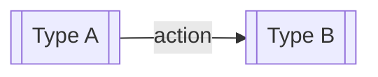

# Commande /personas-projet

Rédige ou met à jour le document `personas.md` du projet courant.

Un persona ici n'est **pas** un profil marketing. C'est la description fonctionnelle d'un type d'utilisateur : ce qu'il peut faire dans l'application, comment il y accède, et en quoi il se distingue des autres types.

> **Règle absolue :** pas de prénoms fictifs, pas d'âge, pas de CSP, pas de motivations psychologiques. Uniquement des comportements observables dans l'application.

---

## Étape 1 — Analyser le contexte

Lis `vision.md` et `processus.md` si disponibles. Extrait ce que tu peux avant de poser des questions.

Questions à poser uniquement si le contexte ne suffit pas :

1. Combien de types d'utilisateurs distincts l'application reconnaît-elle ?
2. Pour chaque type : que peut-il faire, et que ne peut-il pas faire ?
3. Comment arrive-t-il dans l'application ?
4. Y a-t-il une hiérarchie ou une progression entre les rôles ?

## Étape 2 — Structurer selon le nombre de types

**Un seul type d'utilisateur** : section unique "Utilisateur" avec capacités et points d'entrée. Diagramme Mermaid uniquement si les points d'entrée sont multiples.

**Plusieurs types** : tableau récapitulatif en introduction + une section par type + diagramme Mermaid des relations entre rôles.

## Étape 3 — Rédiger

**Règles pour les capacités :**
- Verbe à l'infinitif + objet : "Importer un billet" ✓ — "Gestion des billets" ✗
- Lister uniquement les capacités propres à ce type
- Si un type hérite des capacités d'un autre, le préciser plutôt que tout répéter

**Règles pour les diagrammes Mermaid :**
- `flowchart LR` pour les relations entre rôles
- `flowchart TD` pour les parcours d'entrée dans l'app
- 5 nœuds maximum, une seule idée par diagramme
- Si deux idées : deux diagrammes séparés avec titres

**À ne jamais inclure :**
- Prénom fictif, âge, CSP, niveau d'études
- Frustrations supposées ou motivations psychologiques
- Tout élément ne se référant pas au comportement dans l'application

## Étape 4 — Sauvegarder

- Si `docs/01_product/` existe → `docs/01_product/personas.md`
- Sinon → `personas.md` à la racine
- Si le fichier existe et que la mise à jour est partielle : modifier uniquement les types concernés, conserver les autres

## Étape 4b — Régénération de mkdocs.yml (mécanique)

Régénérer `mkdocs.yml` en exécutant le générateur du plugin ezacae-doc — **jamais** en écrivant le YAML à la main. `${CLAUDE_PLUGIN_ROOT}` est substitué par Claude Code au moment de l'exécution ; l'utiliser tel quel, en passant la racine du projet (défaut : répertoire courant) :

```bash
"${CLAUDE_PLUGIN_ROOT}/scripts/gen-mkdocs.sh" "<racine du projet>"
```

Si `${CLAUDE_PLUGIN_ROOT}` apparaît non substitué (chemin littéral), le **signaler** au lieu d'écrire le YAML à la main.

Le script scanne `docs/`, (re)crée `mkdocs.yml` à la racine et **garantit sa présence** — sans ce fichier, pas de conversion Markdown → HTML. Il porte la table de correspondance dossier → section / fichier → label (source unique de vérité) et reflète l'ajout comme la suppression de `.md`. Si le script échoue (pas de `docs/`, aucun `.md`), le signaler au lieu de contourner.

## Étape 5 — Présenter

Lien vers le fichier + nombre de types documentés en une phrase.

---

## Format de référence — Un seul type

```markdown
# Personas — [Nom du projet]

> **Statut :** Brouillon
> **Propriétaire :** Product Owner
> **Dernière mise à jour :** [DATE]

---

## Utilisateur

[Description fonctionnelle en 2-3 phrases.]

### Ce qu'un utilisateur peut faire

- [Capacité 1]
- [Capacité 2]

### Point d'entrée dans l'application

[Description.]

---

## Liens

- [Vision produit](../00_vision/vision.md)
- [Processus métier](./processus.md)
```

## Format de référence — Plusieurs types

```markdown
# Personas — [Nom du projet]

> **Statut :** Brouillon
> **Propriétaire :** Product Owner
> **Dernière mise à jour :** [DATE]

---

## Vue d'ensemble

| Type | Rôle fonctionnel | Accès |
|------|-----------------|-------|
| [Type A] | [Description courte] | [Comment] |
| [Type B] | [Description courte] | [Comment] |



---

## [Type A]

[Description fonctionnelle.]

### Ce que [Type A] peut faire

- [Capacité propre]

### Point d'entrée

[Description.]

---

## [Type B]

[Description. Préciser si Type B hérite des capacités de Type A.]

### Ce que [Type B] peut faire (en plus de [Type A])

- [Capacité supplémentaire]

---

## Liens

- [Vision produit](../00_vision/vision.md)
- [Processus métier](./processus.md)
```
