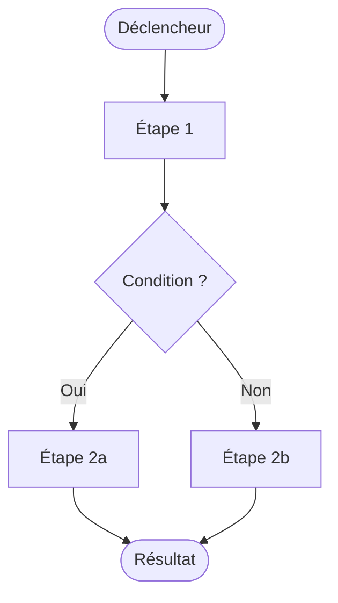

# Commande /processus-projet

Rédige ou met à jour le document `processus.md` du projet courant.

Chaque processus décrit un enchaînement d'actions pour accomplir un objectif dans l'application. Le document combine une **description narrative** et un **diagramme Mermaid**.

> **Règles absolues :**
> - Pas de user stories ni de critères d'acceptance
> - Pas de détails d'implémentation technique (API, BDD, framework)
> - Les acteurs référencent les **types** définis dans `personas.md`, jamais des prénoms fictifs

---

## Étape 1 — Inventorier les processus

Lis `vision.md` et `personas.md` si disponibles. Identifie chaque processus comme un objectif utilisateur autonome : début, enchaînement, résultat observable.

Questions si le contexte manque :

1. Quels sont les grands objectifs qu'un utilisateur peut accomplir ?
2. Pour chaque objectif : quelles étapes, dans quel ordre ?
3. Y a-t-il des embranchements ou conditions ?
4. Y a-t-il des règles métier importantes ou des points de friction connus ?

## Étape 2 — Structurer chaque processus

**La description répond à :**
- Quel contexte déclenche ce processus ?
- Quelles sont les étapes clés en langage naturel ?
- Quel est le résultat final pour l'utilisateur ?
- Quels sont les points d'attention (règles métier, cas limites) ?

**Le diagramme Mermaid :**
- `flowchart TD` par défaut
- Nœud déclencheur `([...])` → étapes → nœud résultat `([...])`
- Embranchements en losanges `{...}` avec labels sur les flèches
- 6 à 12 nœuds maximum
- Si trop complexe : deux diagrammes séquentiels plutôt qu'un seul illisible

**Les points d'attention :**
- Section obligatoire sous chaque processus
- 2 à 5 items, formulés comme des règles ou des risques concrets
- Chaque point est actionnable, pas une reformulation vague

## Étape 3 — Ordonner les processus

1. Processus d'entrée (inscription, connexion)
2. Processus de création / import
3. Processus de consultation
4. Processus d'action / partage / collaboration

## Étape 4 — Sauvegarder

- Si `docs/01_product/` existe → `docs/01_product/processus.md`
- Sinon → `processus.md` à la racine
- Mise à jour partielle : modifier uniquement les processus concernés, conserver les autres intact

## Étape 4b — Régénération de mkdocs.yml (mécanique)

Régénérer `mkdocs.yml` via le générateur du plugin — **jamais** à la main. Procédure complète : `${CLAUDE_PLUGIN_ROOT}/references/regen-mkdocs.md`. En bref :

```bash
"${CLAUDE_PLUGIN_ROOT}/scripts/gen-mkdocs.sh" "<racine du projet>"
```

## Étape 5 — Présenter

Lien vers le fichier + liste des processus documentés en une ligne.

---

## Format de référence

```markdown
# Processus métier — [Nom du projet]

> **Statut :** Brouillon
> **Propriétaire :** Product Owner
> **Dernière mise à jour :** [DATE]

---

## Vue d'ensemble

| # | Processus | Acteur |
|---|-----------|--------|
| [P1](#p1--titre) | [Titre] | [Type fonctionnel depuis personas.md] |
| [P2](#p2--titre) | [Titre] | [Type fonctionnel depuis personas.md] |

---

## P1 · [Titre]

### Description

[Contexte et déclencheur. 2 à 4 phrases.]

[Étapes clés en langage naturel. 3 à 6 phrases.]

**Points d'attention :**
- [Règle métier ou risque 1]
- [Règle métier ou risque 2]



---

## Liens

- [Vision produit](../00_vision/vision.md)
- [Personas](./personas.md)
```
