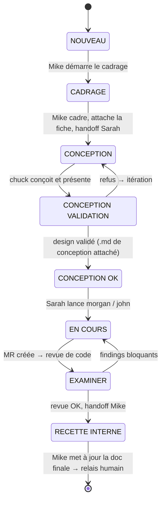

# Pipeline Mike ⇄ Sarah — orchestration pilotée par JIRA

> **Statut : Actif** — Document de référence du couplage des agents ezacae autour d'un ticket JIRA.

## Objectif

Coupler l'orchestrateur **documentaire** (Mike) et l'orchestrateur du **cycle de développement** (Sarah) autour d'un **ticket JIRA unique** qui sert de **contrat de passation**. Chaque agent lit le ticket en entrée, produit des artefacts, les **attache** au ticket (vraies pièces jointes via l'API REST), **transitionne** le statut, **commente** pour la traçabilité, puis passe la main.

Aucun agent ne devine l'état du travail : **le statut du ticket est la source de vérité** et c'est lui qui détermine quel agent a le droit de s'activer.

---

## Liste des agents

| Agent | Type | Rôle dans le pipeline |
|-------|------|-----------------------|
| **Mike** | Commande `/mike` | Orchestrateur documentaire. Crée/lit le ticket, cadre le besoin (produit), met à jour la doc, attache son résultat, passe la main. Réenclenché en fin de cycle pour la doc finale. |
| **Mike-PO / Mike-CTO** | Commandes | Sous-orchestrateurs produit / technique appelés par Mike (inchangés). |
| **Sarah** | Commande `/sarah` | Orchestrateur du cycle de dev. Conçoit → implémente → fait reviewer. Ne touche jamais au code elle-même. |
| **chuck** | Skill | Conception technique (specification + plan TDD). Propriété de l'exploration et du design. |
| **morgan** | Skill | Implémentation **autonome** guidée par la conception (branche, TDD, push, MR). Sous-agent worktree. |
| **john** | Skill | Implémentation **interactive** (petite modif / bug sans conception lourde). |
| **pr-review-toolkit:code-reviewer** | Agent | Revue de code multi-axes sur le diff. Déclenché par Sarah en fin d'implémentation. |
| **skill `jira-pipeline`** (`SKILL.md`) | Skill (plugin ezacae-jira) | Conventions JIRA **communes** à Mike et Sarah (credentials, transitions, gardes, format de commentaire). Source unique — remplace l'ancien `shared/jira.md`. |

morgan et john restent **inchangés** : toute l'orchestration JIRA vit au niveau de Mike et Sarah.

---

## Le contrat de passation : le ticket JIRA



> Au-delà de `RECETTE INTERNE`, les statuts `RECETTE CLIENT`, `TO DEPLOY`, `TERMINÉ(E)` sont pilotés **humainement / par la CI/CD** (le déploiement est hors scope des agents). `VALIDATION KO` et `ANNULÉ` sont des états de rejet/annulation manuels, non nominaux.

---

## Règles de garde (qui peut s'activer sur quel statut)

Le statut du ticket **route** l'agent. À l'entrée, chaque agent vérifie le statut et **s'arrête proprement** s'il n'a pas le droit d'intervenir.

| Agent | Statut(s) d'activation autorisé(s) | Garde supplémentaire |
|-------|------------------------------------|----------------------|
| **Mike** | `NOUVEAU`, `CADRAGE` **ou** `RECETTE INTERNE` | Sur `NOUVEAU`, passe le ticket en `CADRAGE` dès le début du cadrage |
| **Sarah** | `CONCEPTION` | Ne lance **morgan / john** que si le ticket est passé à **`CONCEPTION OK`** |

Conséquence : c'est **le statut qui décide du point d'entrée**. Sur un ticket existant (UC2), appeler `/mike` ne fait quelque chose que si le ticket est `NOUVEAU`/`CADRAGE`/`RECETTE INTERNE` ; `/sarah` ne fait quelque chose que sur `CONCEPTION`.

Ces gardes ne reposent pas que sur la discipline des agents : deux **hooks Claude Code** (déclarés dans `hooks/hooks.json` du plugin ezacae-jira) les rendent déterministes —
- **`SessionStart`** (`hooks/session-start.sh`) : sync Git + vérification des credentials JIRA + chemin des helpers, injectés en contexte (remplace les Phase 0 bash).
- **`PreToolUse`** (`hooks/jira-guard.sh` + `hooks/jira-allow-bash.sh`) : **auto-autorise les actions JIRA** et **bloque toute transition hors séquence** du pipeline (filet de sécurité actif uniquement sur les tickets déjà dans un statut du pipeline). Voir le skill `jira-pipeline` §5.

---

## Propriété des transitions

| Transition | Déclenchée par | Moment |
|------------|----------------|--------|
| `→ NOUVEAU` | Mike | Création du ticket (UC1) |
| `NOUVEAU → CADRAGE` | Mike | Au début du cadrage (marque le ticket comme en cours de cadrage) |
| `CADRAGE → CONCEPTION` | Mike | Après cadrage doc, avant de passer la main à Sarah |
| `CONCEPTION → CONCEPTION VALIDATION` | Sarah (chuck) | Quand le design est présenté pour validation |
| `CONCEPTION VALIDATION → CONCEPTION` | Sarah | Si l'utilisateur refuse le design (itération) |
| `CONCEPTION VALIDATION → CONCEPTION OK` | Sarah | Design validé par l'utilisateur |
| `CONCEPTION OK → EN COURS` | Sarah | Lancement de morgan / john |
| `EN COURS → EXAMINER` | Sarah | MR créée, début de la revue |
| `EXAMINER → EN COURS` | Sarah | Findings bloquants à corriger |
| `EXAMINER → RECETTE INTERNE` | Sarah | Revue OK, avant de rendre la main à Mike |
| (reste `RECETTE INTERNE`) | Mike | Doc finale attachée ; relais humain ensuite |

Les **IDs** de transition sont propres à l'instance JIRA et ne sont jamais codés en dur : chaque agent appelle `getTransitionsForJiraIssue`, trouve la transition dont le **nom de statut cible** correspond à l'étape voulue, puis l'exécute (voir le skill `jira-pipeline` §5).

---

## Flux complet (séquence)

```mermaid
sequenceDiagram
    actor U as Utilisateur
    participant M as Mike
    participant J as JIRA
    participant S as Sarah
    participant CH as chuck
    participant MO as morgan / john
    participant R as code-reviewer

    U->>M: "ajoute une fonctionnalité" (UC1) / clé de ticket (UC2)
    alt UC1 — pas de ticket
        M->>J: createJiraIssue (→ NOUVEAU)
    else UC2 — ticket existant
        M->>J: getJiraIssue (garde : statut == NOUVEAU / CADRAGE) + lecture des commentaires
    end
    M->>J: transition NOUVEAU → CADRAGE (début du cadrage)
    M->>M: audit doc, route Mike-PO / Mike-CTO, MAJ doc (prise en compte des commentaires)
    M->>J: jira-attach.sh — fiche de cadrage
    M->>J: transition CADRAGE → CONCEPTION + commentaire de passation
    M->>S: invoke /sarah <KEY>

    S->>J: getJiraIssue (garde : statut == CONCEPTION)
    S->>J: jira-download.sh — récupère la fiche de Mike
    S->>CH: conception (sur la base du ticket + fiche)
    CH->>J: transition → CONCEPTION VALIDATION
    U-->>CH: validation du design
    S->>J: jira-attach.sh — conception .md ; transition → CONCEPTION OK
    S->>MO: implémentation (garde : statut == CONCEPTION OK)
    MO->>J: transition → EN COURS
    MO-->>S: MR créée
    S->>J: lie la MR (commentaire) ; transition → EXAMINER
    S->>R: revue de code sur le diff
    R-->>S: findings priorisés
    S->>J: poste le rapport de revue (commentaire)
    S->>J: transition → RECETTE INTERNE
    S->>M: invoke /mike <KEY>

    M->>J: getJiraIssue (garde : statut == RECETTE INTERNE)
    M->>M: met à jour la documentation finale
    M->>J: jira-attach.sh — doc finale + commentaire (reste RECETTE INTERNE)
    M-->>U: pipeline automatisé terminé → relais recette humaine
```

---

## Les deux cas d'usage

### UC1 — Demande de fonctionnalité, pas de ticket

1. L'utilisateur demande une fonctionnalité à **Mike**.
2. Mike **crée le ticket** dans le bon projet (résolution via `getVisibleJiraProjects` + mapping `CLAUDE.md`, sinon il demande) au statut `NOUVEAU`.
3. Mike **transitionne le ticket en `CADRAGE`** dès le début du cadrage, puis fait son travail habituel : lecture des commentaires du ticket, audit de complétude, routage Mike-PO / Mike-CTO, mise à jour de la doc produit/technique.
4. Mike produit une **fiche de cadrage fonctionnel** (le « fichier de résultat »), l'**attache** au ticket, le **transitionne** en `CONCEPTION`, **commente** la passation, puis **invoque `/sarah <KEY>`**.
5. **Sarah** vérifie le statut (`CONCEPTION`), **télécharge** la fiche de Mike, et la passe à **chuck**.
6. chuck conçoit → `CONCEPTION VALIDATION` → l'utilisateur valide → Sarah **attache** le `.md` de conception et transitionne en `CONCEPTION OK`.
7. Sarah lance **morgan** (ou **john**) → `EN COURS` → MR → Sarah **lie la MR** et transitionne en `EXAMINER`.
8. Sarah déclenche **pr-review-toolkit:code-reviewer** sur le diff → **poste le rapport** sur le ticket.
9. Sarah transitionne en `RECETTE INTERNE` et **redéclenche Mike** (`/mike <KEY>`).
10. Mike vérifie le statut (`RECETTE INTERNE`), **met à jour la documentation finale**, l'attache, commente. Le ticket reste `RECETTE INTERNE` pour la recette humaine.

### UC2 — Le ticket JIRA existe déjà

Identique, sauf que **le contenu du ticket est la source de vérité** au lieu d'une demande orale :

- Mike (sur `NOUVEAU` ou `CADRAGE`) **lit** le ticket et ses **commentaires** (`getJiraIssue`) et cadre sur cette base au lieu de le créer ; sur `NOUVEAU`, il passe d'abord le ticket en `CADRAGE`.
- Sarah (sur `CONCEPTION`) se base sur le contenu du ticket + la fiche attachée.
- Toutes les règles de PJ, transitions, commentaires et gardes sont **identiques** à UC1.

C'est le **statut courant** du ticket qui détermine où l'on entre dans le pipeline.

---

## Opérations JIRA via helpers REST (pipeline non-interactif)

Les agents pilotent JIRA via des **helpers shell** (API REST v3) **auto-autorisés** par le hook `jira-allow-bash.sh` — c'est ce qui rend le pipeline **non-interactif** (aucune validation manuelle) et **fonctionnel en headless/cron** (jira-watcher), là où le MCP distant peut manquer :

- `jira-get.sh <CLE> [--comments]` — lecture d'un ticket.
- `jira-comment.sh <CLE> "texte" | -f <fichier>` — commentaire (ADF).
- `jira-transition.sh <CLE> "<STATUT CIBLE>" [--worklog …] [--comment …]` — transition par nom de statut, **garde de statut intégrée**.
- `jira-edit.sh <CLE> [--summary|--description|--label|--assignee …]` — édition de champs.
- `jira-attach.sh <CLE> <fichier...>` / `jira-download.sh <CLE> <dossier> [filtre]` — pièces jointes (le MCP n'offre pas l'upload).

**Prérequis** : `JIRA_BASE_URL`, `JIRA_EMAIL`, `JIRA_API_TOKEN` (+ `jq`). Voir le skill `jira-pipeline` (§1, §4). Restent côté **MCP Atlassian** (repli) : création de ticket, recherche JQL, liste des projets, liens entre tickets.

---

## Fichiers du pipeline

> Tous les fichiers ci-dessous vivent dans les **plugins** du marketplace `ezacae-claude-tooling`, plus dans le `.claude/` du projet courant (credentials).

| Fichier | Plugin | Rôle |
|---------|--------|------|
| `skills/jira-pipeline/PIPELINE.md` | ezacae-jira | Ce document. |
| `skills/jira-pipeline/SKILL.md` | ezacae-jira | Référentiel JIRA commun (chargé par Mike et Sarah). Remplace l'ancien `shared/jira.md`. |
| `scripts/jira-lib.sh` | ezacae-jira | Bibliothèque partagée (credentials, curl, garde de statut, ADF) — sourcée par les helpers et `jira-guard.sh`. |
| `scripts/jira-get.sh` | ezacae-jira | Lecture d'un ticket (+ commentaires). |
| `scripts/jira-comment.sh` | ezacae-jira | Ajout de commentaire (ADF). |
| `scripts/jira-transition.sh` | ezacae-jira | Transition par nom de statut, garde intégrée. |
| `scripts/jira-edit.sh` | ezacae-jira | Édition de champs (résumé, description, labels, assigné). |
| `scripts/jira-attach.sh` | ezacae-jira | Upload de pièces jointes. |
| `scripts/jira-download.sh` | ezacae-jira | Récupération de pièces jointes. |
| `hooks/hooks.json` | ezacae-jira | Déclaration des hooks (SessionStart + PreToolUse). |
| `hooks/session-start.sh` | ezacae-jira | Pré-checks Git + JIRA + chemin des helpers, injectés au démarrage. |
| `hooks/jira-guard.sh` | ezacae-jira | Garde de statut : bloque les transitions hors séquence. |
| `hooks/jira-allow-bash.sh` | ezacae-jira | Auto-autorise les helpers `jira-*.sh`. |
| `<projet>/.claude/jira.env` | _projet_ | Credentials JIRA (gitignoré, copié depuis `jira.env.example`). |
| `commands/mike.md` | ezacae-doc | Orchestrateur documentaire (intègre les phases JIRA). |
| `commands/sarah.md` | ezacae-dev | Orchestrateur de dev (intègre les phases JIRA). |
| `commands/feature.md` | ezacae-dev | Redirige vers ce pipeline (déprécié). |
